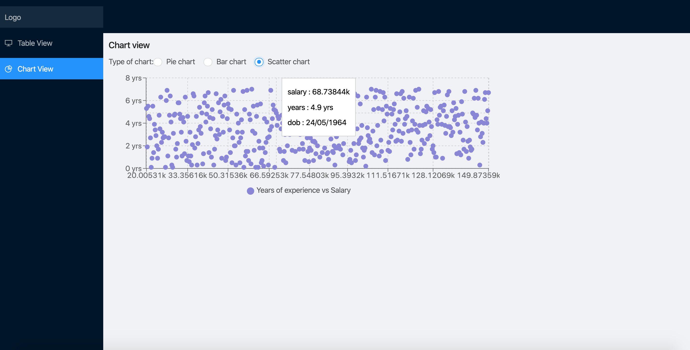

Yobota Coding challenge (test question can be found [here](./ReactTest.pdf))
==============================
This repository holds the Express and ReactJS based UI Layer for the test.
This test leverages a number of different technologies to build a scalable UI that displays data. 


Overview
=========
The test comprises of a ReactJS client served by an Express backend.
The Express backend would be responsible for the integration to other elements of the ecosystem, whilst
the ReactJS and Redux models maintain the performance of the user experience.
The application is compiled using Webpack.

Getting Started
===========
Start by creating a copy of the .env.example file, renaming it .env, and update the properties:
```bash
GA_TRACKING_NUMBER='Google analytics tracking code'
```

The application can be served locally using Webpack through Express with hot reloading via:
```bash
npm install && npm start
```
This will compile and then watch/re-compile the src for both the server and the client. In this
build, Webpack is flagged as "development" mode, source-maps are in place, and Hot reloading
will occur.

Head over to 
```bash
localhost:8080 
```
once the application has been installed and executed.


To build the production version
```bash
npm run dist
```
will minify and obfuscate and remove source-maps from the dist.

Each build has it's own webpack config, dev/prod for the client and "server" for the server. This
will use the mode to determine which of the two available ./src/server/server.js files to use. This 
is required to allow for the include of development only dependencies.

Table view
=============
The table view does the following: 

- supports pagination for

- supports sorting DOB, industry, experience, salary

- supports search filtering on name


- I would use something very similar to the following gif for inline editing, the change would fire the action which would in turn call to make the CREATE/UPDATE request. 


Chart view
=============
I did not really understand the requirements so I displayed pieces of data against other pieces of data. 


Improvements
=============
- apply some sort of filter to the chart view
- Behavioural and e2e tests
- streamline the data flow
- CSS, very little styles were applied
- put the industries and the autocomplete functionality on the backend

